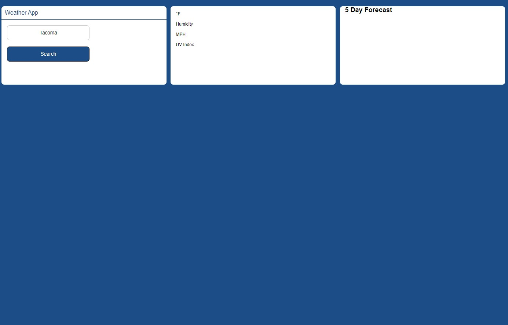

UW Coding Bootcamp Assignment 6: Weather Dashboard

Created a weather dashboard that allows a user to type in a city and get predetermined weather conditions. The city is then sent to local storage as a button that can be clicked to review the results again, after the user types another city.

GitHub URL:

GitPages URL:

